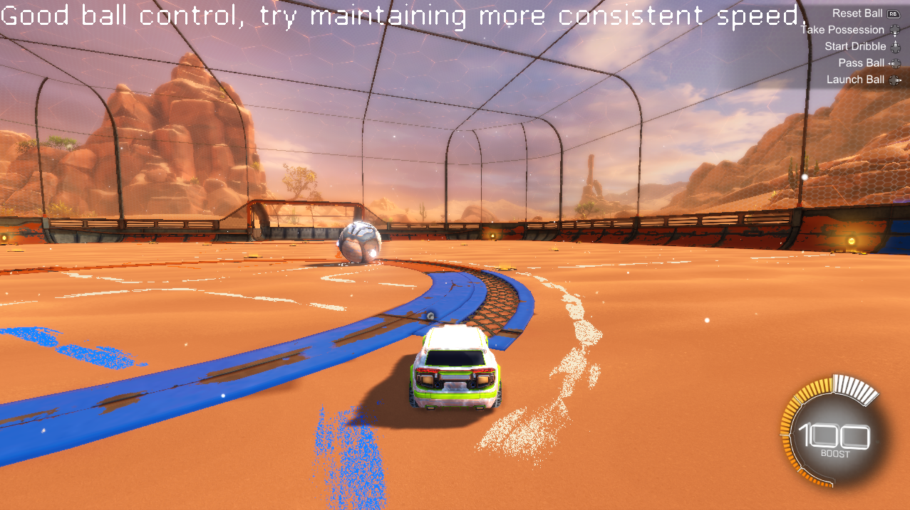
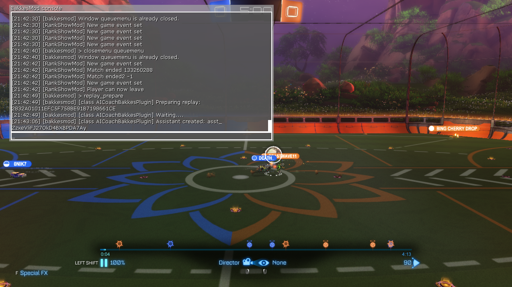

# ai-portland-rocketleague
Materials/code for a [10 minute presentation](https://www.meetup.com/ai-portland/events/303283141/?eventOrigin=group_upcoming_events) for an [AI Portland](https://creators.spotify.com/pod/show/superchargedbyai/) on using AI for Game analysis and self-coaching

See the [TODOs](TODO.md) prior to presentation

## Overview

Rocket League is a fast-paced game requiring quick reflexes, precise control, and strategic team play. This project explores three primary approaches to game and AI integration:

### 1. [DribbleCoach](./DribbleCoach/README.md) **: Live Mechanics Feedback**

   - **Description**: Real-time analysis of player mechanics during freeplay using a [bakkesmod](https://github.com/bakkesmodorg/BakkesModSDK) plugin that calls Anthropic's Claude 3.5-Sonnet model providing live coaching feedback during tracked ground dribble practice in Rocket League.  ([recorded example](https://www.youtube.com/watch?v=vU-K88mYVAU) )
   - **Features**:
     - Identifies the mechanical skill of ground dribbling.
     - Offers simple suggestions on optimal timing, positioning, and ball control.
   - **ToDo**:
     - Provide actionable feedback for air dribbling and flicks as well.

### 2. [ReplayAssistant](./ReplayAssistant/README.md) **: Interactive Feedback on replay data**


   - **Description**: Extracts replay binary data into CSVs repsenting goals, highlights, statistics and frames, uploads them to OpenAI files, creates an OpenAI assistant on the replay data, and seeds an initial prompt.
   - available commands during replay

prepare an OpenAI Assistant for the current replay
```bash
replay_prepare # this command 
```

free form prompt
```bash
replay_prompt tell me how many times I hit the ball. 
```

default prompt
```bash
replay_prompt 
```
      * Evaluate the replay on boost efficiency, aerial control, and shot accuracy using the csv files.  The csv files are linked by a primary key column 'Frame'. Provide insights on situational awareness, risk/reward trade-offs, mechanical highlights.  Also focus on team play, indentifying dominant roles.

   - **ToDo**:
     - create replay_prompt using created assistant

### 3. [ScreenShareCoach](./ScreenShareCoach/README.md) **: Live Replay with Video and Audio Feedback**
   - **Description**: Live video stream analysis tailored for individual players.  (CARL, replay, spoken discussion, etc)
   - [Gemini 2.0 video stream analysis](https://aistudio.google.com/live) - Live replay analysis of the video stream and [CARL](https://lndrlndr.github.io/) statistics.  ([recorded example](https://www.youtube.com/watch?v=2OnrUEvSvAo))
   - **Goal**: Help players understand their strengths and areas for improvement through detailed, context-rich spoken feedback to live replay data.s

## Objectives

- Improve player mechanics and strategic understanding.
- Foster better teamwork and communication within teams.
- Deliver actionable, easy-to-understand insights to players of all skill levels.
- Advance the use of AI in gaming to create a more immersive and educational experience.

## License

This project is licensed under the [Apache 2 License](LICENSE).
