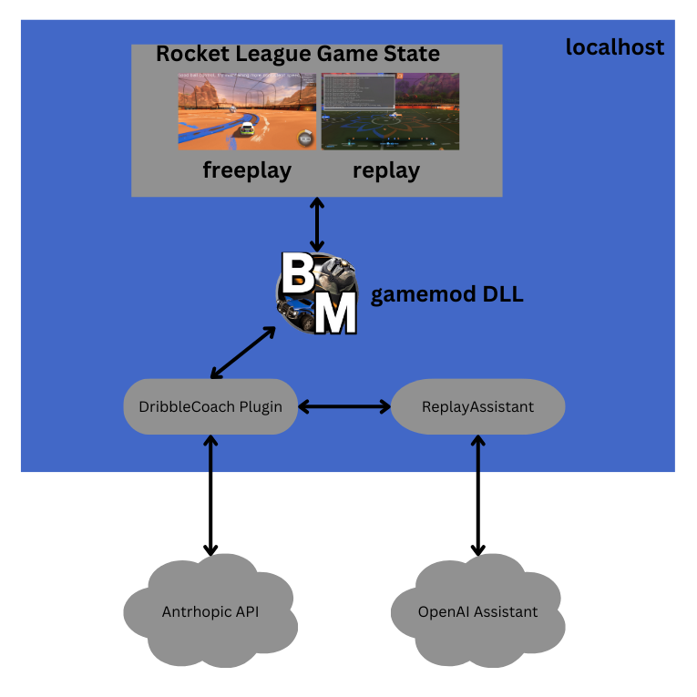

# ai-portland-rocketleague
Materials/code for a [10 minute presentation](https://www.meetup.com/ai-portland/events/303283141/?eventOrigin=group_upcoming_events) for an [AI Portland](https://creators.spotify.com/pod/show/superchargedbyai/) on using AI for Game analysis and self-coaching


## Overview

Rocket League is a fast-paced game that demands quick reflexes, precise control, and strategic team play. This project explores two primary approaches to integrating game mechanics with AI:

* **Mechanics Feedback:** Anthropic's Claude Sonnet 3.5 model was used to provide feedback on player mechanics during freeplay.
* **Replay Prompt:** OpenAI's Assistant API was used for a replay prompt during replays.



### 1. [DribbleCoach](./DribbleCoach/README.md) **: Mechanics Feedback**

   - **Description**:  Textual feedback of ground and air dribble mechanics using Anthropic's Claude during freeplay.
     - Identifies and tracks the mechanical skill of ground and air dribbling.
     - Offers simple suggestions on optimal timing, positioning, and ball control.
   - **ToDo**:
     - Fine-tune air dribbling tracking.
     - Provide flick feedback.

### 2. [ReplayAssistant](./ReplayAssistant/README.md) **: Replay Prompt**


   - **Description**: Extracts replay data and creates an OpenAI assistant available on the current replay.

available commands

prepare an OpenAI Assistant for the current replay
```bash
replay_prepare
```

free form prompt
```bash
replay_prompt How many times did I hit the ball towards my own goal or it front of it?
```

default prompt 
```bash
replay_prompt 
```
default prompt is equivalent to
```bash
replay_prompt Evaluate the replay on boost efficiency, aerial control, and shot accuracy using the csv files.  The csv files are linked by a primary key column 'Frame'. Provide insights on situational awareness, risk/reward trade-offs, mechanical highlights.  Also focus on team play, indentifying dominant roles.
```
   - **ToDo**:
     - Finish replay_prompt
     - Provide ai response replay overlays

## Objectives

- Improve player mechanics and strategic understanding.
- Foster better teamwork and communication within teams.
- Deliver actionable, easy-to-understand insights to players of all skill levels.
- Advance the use of AI in gaming to create a more immersive and educational experience.

## Similar and Related Services/Projects
* [polr](https://rldatacoach.com/polr-rocket-league-ai-coach/)
* [trophi.ai](https://www.trophi.ai/rocket-league)
* [bakkesmod](https://bakkesmod.com/)
* [carl](https://lndrlndr.github.io/)
* [rlgym](https://rlgym.org/)
* [replay review plugin](https://bakkesplugins.com/plugins/view/173)
* [ballchasing.com](https://ballchasing.com/)
* [rocketleague.tracker.network/](https://rocketleague.tracker.network/)

## License

This project is licensed under the [Apache 2 License](LICENSE).
