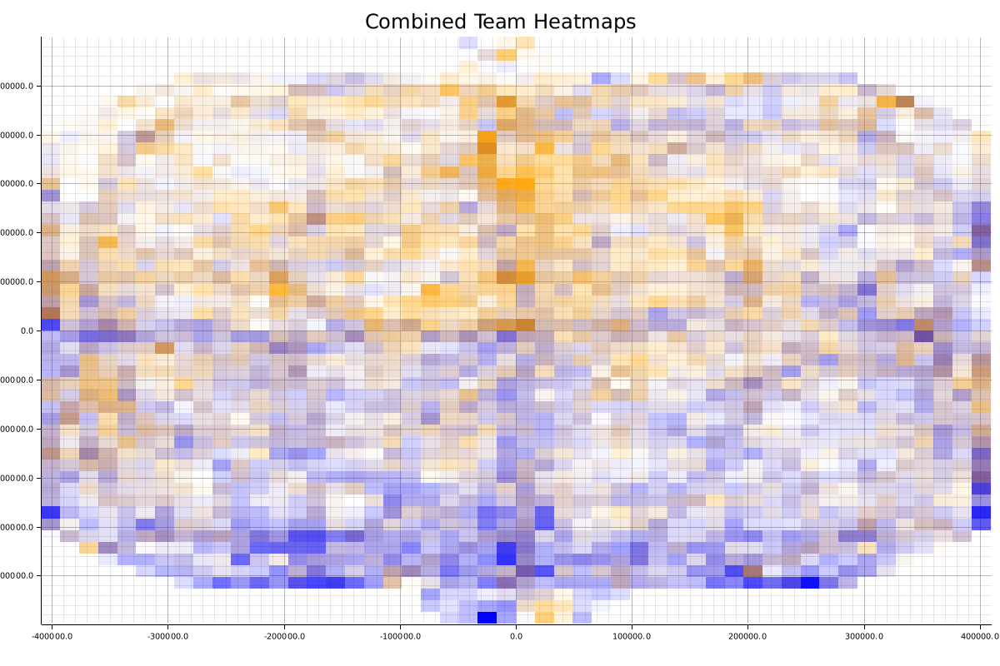
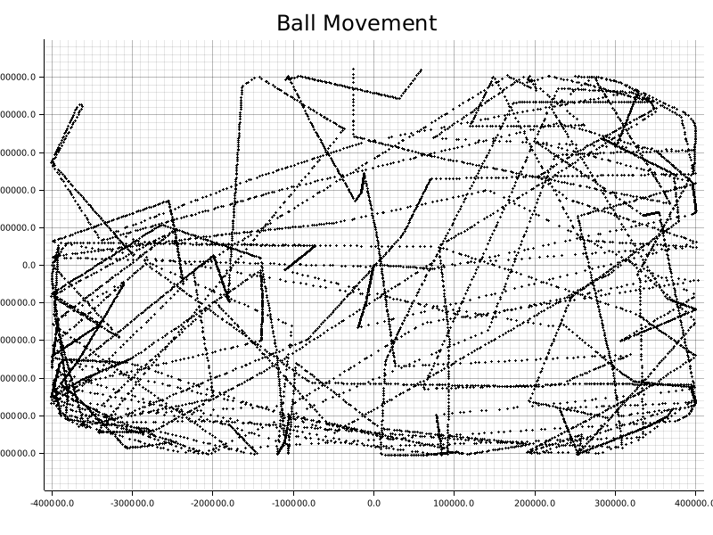

# Rattlebrain Replay Analysis

## Anthropic response

 I'll analyze the Rocket League match data and provide feedback across the key areas:

Strategy Analysis:
1. Team Positioning & Rotations
- The low number of goals (2-0) and relatively low number of shots suggests defensive, cautious play from both teams
- Team 0 (winners) had better shot conversion, scoring 2 goals from 2 shots
- Multiple saves (3 total) indicates decent defensive positioning and rotation
- Limited assists (only 1) suggests room for improvement in team passing plays and coordination

Mechanics Analysis:
1. Boost Management & Efficiency
- Overall low scores indicate potential inefficiencies in boost management and mechanical execution
- Team 0 players achieved higher average scores, suggesting better boost and mechanical efficiency
- Player "ALSYG" stands out with highest score (435), showing good mechanical consistency

2. Shot Accuracy
- Very efficient shooting from Team 0 (2 goals from 2 shots)
- Team 1 struggled with accuracy (0 goals from 3 shots)
- Room for improvement in creating quality scoring opportunities

Decision-Making Analysis:
1. Risk/Reward
- Team 0 showed better shot selection (100% conversion rate)
- Defensive decisions were generally sound with multiple saves
- Limited assists suggests conservative play, could look to increase offensive pressure

2. Situational Awareness
- Team 0 capitalized on their opportunities more effectively
- Some players had very low involvement (low scores under 150), indicating positioning or rotation issues

Key Recommendations:
1. Focus on increasing offensive pressure while maintaining defensive structure
2. Work on team passing plays to create better scoring chances
3. Improve mechanical consistency across all players
4. Practice boost management and efficient rotations
5. Develop better communication for coordinated plays

The winning team showed better efficiency in converting opportunities, but both teams could improve their overall offensive coordination and mechanical consistency.
## Gemini response

 ## Rocket League Team Strategy & Player Performance Analysis

This analysis reviews the provided data to offer feedback for improving team performance.  The lack of in-game footage (beyond the highlights) limits the depth of the positioning and rotation analysis, but we can still draw some conclusions from the statistics and goal highlights.

**I. Strategy Analysis:**

* **Positioning and Rotations:**  The statistics show a significant disparity in score between players.  ALSYG (435 points) is significantly outperforming the rest of the team, suggesting a potential imbalance in roles and responsibilities.  Rahz and zen (124 and 142 points respectively) have very low shot counts, indicating they may not be actively seeking offensive opportunities.  ㅚㅥŇicoyㅈい has no shots but contributes assists and saves, indicating a more defensive playstyle.  The team needs to establish clear roles (offensive, defensive, and support) and practice coordinated rotations to ensure all players contribute to both offense and defense.  The highlights suggest a lack of consistent teamwork in the build-up to the goals scored by tender and ALSYG.

* **Synergy:** The low assist numbers across the board (except for one from ALSYG and one from ㅚㅥŇicoyㅈい) highlight a lack of passing and playmaking.  The team needs to work on passing drills, improving communication, and developing a stronger understanding of each other's playing styles.  Successful attacks require more than just individual skill; it demands precise passes and timely support to create scoring chances.

**II. Mechanics Analysis:**

* **Boost Efficiency:**  Without replay analysis, boost efficiency cannot be accurately assessed. However, the low shot count of several players may indicate poor boost management, preventing them from reaching optimal positions for shots and challenges.  Drills focusing on efficient boost usage, including quick pickups and strategic boost saving, are crucial.

* **Aerial Control:**  The highlights do show successful aerial hits (Ball_TA_19 contacts), but the lack of more comprehensive data makes further evaluation impossible.  Aerials are a key component of Rocket League, requiring dedicated practice to refine skills like air dribbles, flicks, and precise aerial shots.

* **Shot Accuracy:** Again, more data is needed. The low goal count is concerning and suggests that the team needs to practice shooting techniques, targeting, and power control.  Drills focusing on different shot types (power shots, flicks, and precise shots) will improve consistency.

**III. Decision-Making Analysis:**

* **Situational Awareness:** The point discrepancy hints at poor situational awareness from some players.  Players need to be more aware of their teammates' positions, the opponent's movements, and the ball's trajectory.  This awareness is crucial for effective rotations, challenges, and support.

* **Risk/Reward Trade-offs:**  Without replay analysis, evaluating risk/reward decisions is difficult. However, if players are consistently making risky plays that lead to turnovers, this needs to be addressed.  Players should be coached on recognizing when to take risks and when to play safe, depending on the game situation.

**Specific Player Feedback:**

* **Rahz & zen:** Focus on seeking more offensive chances. Improve positioning to receive passes and get better shots. Increase communication with teammates. Practice boost management for better offensive positioning.
* **ㅚㅥŇicoyㅈい:** Maintain the defensive role but look for opportunities to create more assists by anticipating teammate needs.
* **Paid Carry Nordic:** The lack of stats suggests this player needs to actively participate in both offensive and defensive plays.
* **tender:**  Although he scored one goal, he needs more consistent offensive contributions. Work on shot accuracy and teamwork.
* **ALSYG:**  While performing extremely well, ALSYG should focus on creating more opportunities for teammates and passing more often to build a more balanced team offense.

**Overall Recommendations:**

* **Implement structured training:** Focus on drills to improve passing, boost management, aerial control, and shot accuracy.
* **Establish clear roles and responsibilities:** Define each player's role within the team's offensive and defensive strategy.
* **Improve communication:**  Encourage clear and concise communication during matches, particularly regarding rotations and passing intentions.
* **Analyze replays:**  Review replays together to identify strengths and weaknesses in positioning, rotations, and decision-making.
* **Focus on teamwork:** Emphasize the importance of passing and supporting teammates to create high-percentage scoring opportunities.

By addressing these areas, the team can dramatically improve their synergy, coordination, and overall performance.  The provided data highlights a significant performance gap, indicating a need for concentrated effort on team play rather than solely individual skill development.

